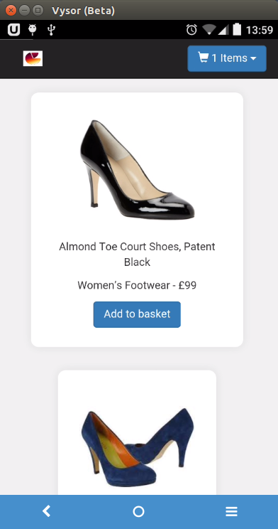

## AngularJS Store

##### I have developed a front-end Store using HTML, JavaScript, AngularJS, CSS3 & Bootstrap.

This is how the front-end app looks like:

I have completed the first three user stories:

1. As a User I can add a product to my shopping cart.
2. As a User I can remove a product from my shopping cart.
3. As a User I can view the total price for the products in my shopping
cart.

User stories yet to be implemented:

4. As a User I can apply a voucher to my shopping cart.
5. As a User I can view the total price for the products in my shopping cart
with discounts applied.
6. As a User I am alerted when I apply an invalid voucher to my shopping
cart.
7. As a User I am unable to Out of Stock products to the shopping cart.

##Instructions:

Make sure you have node and bower installed:

node -v
bower -v

Make sure they both return a version number. Otherwise you will need to install them:

brew install node
npm install -g bower

After cloning the repo in your computer, 'cd' in the app directory and run 'bower install' and 'npm install'. Then start a server: "http-server".
